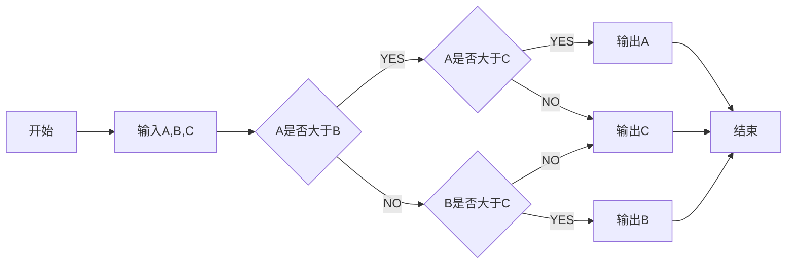

## kmeans算法
**这里放一些算法说明**
### 1 算法解决的问题
* 说明算法的应用背景等
### 2 算法思路
* step1 blabla...
* step2 blabla...
* step3 blabla...
* step4 流程图

```mermaid
graph LR
    start[开始] --> input[输入A,B,C]
    input --> conditionA{A是否大于B}
    conditionA -- YES --> conditionC{A是否大于C}
    conditionA -- NO --> conditionB{B是否大于C}
    conditionC -- YES --> printA[输出A]
    conditionC -- NO --> printC[输出C]
    conditionB -- YES --> printB[输出B]
    conditionB -- NO --> printC[输出C]
    printA --> stop[结束]
    printC --> stop
    printB --> stop
```